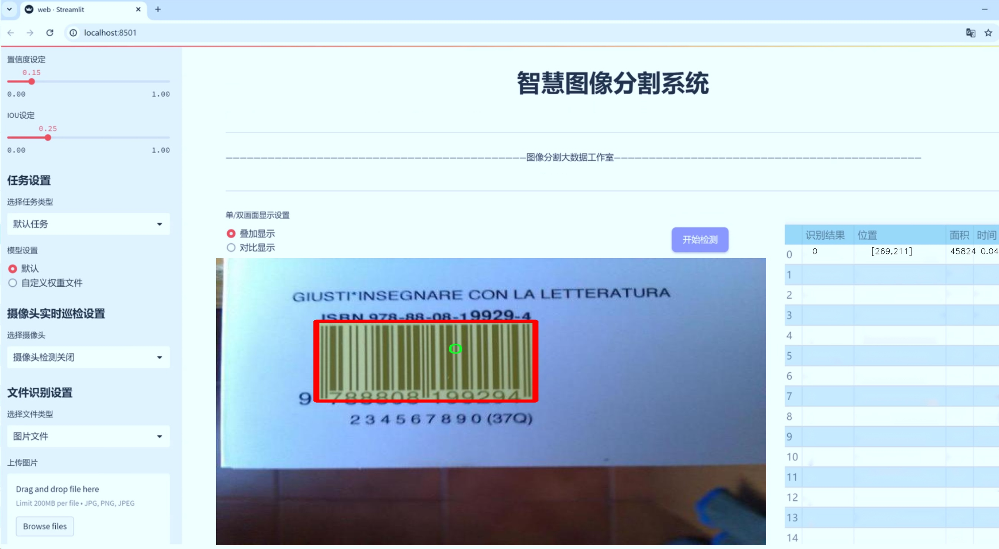
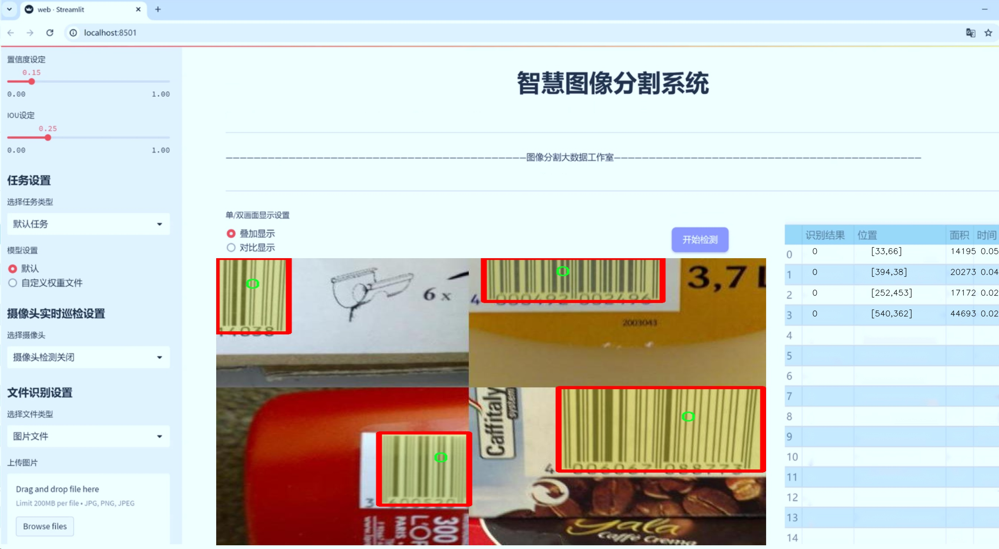
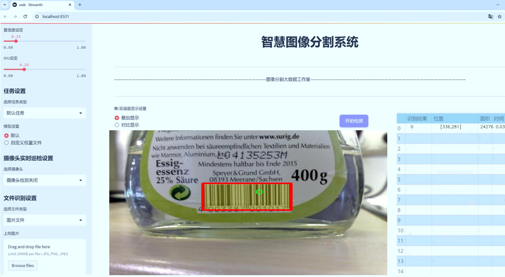
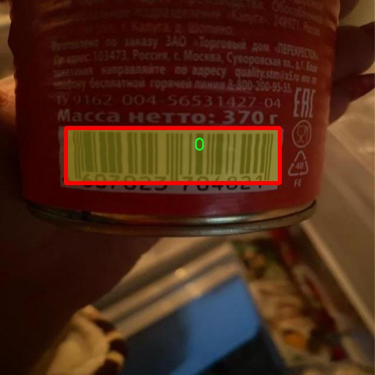
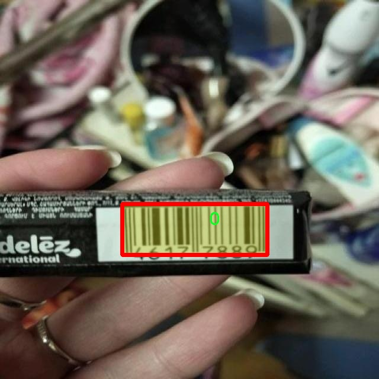
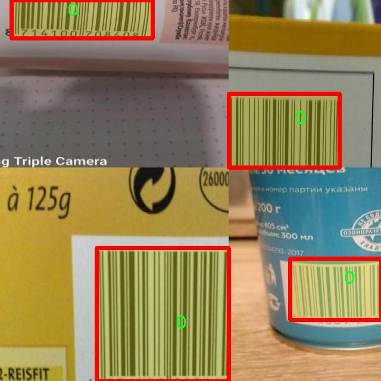
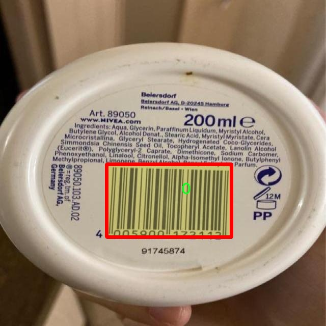
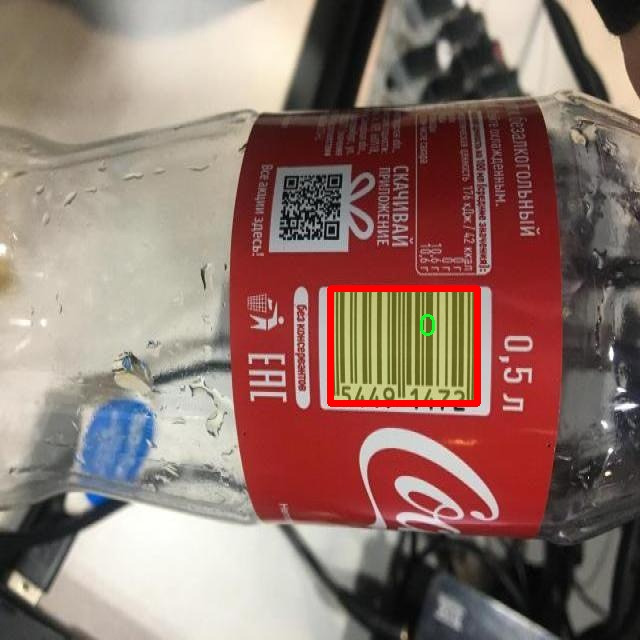

# 条形码图像分割系统源码＆数据集分享
 [yolov8-seg-SPDConv＆yolov8-seg-swintransformer等50+全套改进创新点发刊_一键训练教程_Web前端展示]

### 1.研究背景与意义

项目参考[ILSVRC ImageNet Large Scale Visual Recognition Challenge](https://gitee.com/YOLOv8_YOLOv11_Segmentation_Studio/projects)

项目来源[AAAI Global Al lnnovation Contest](https://kdocs.cn/l/cszuIiCKVNis)

研究背景与意义

随着信息技术的迅猛发展，条形码作为一种重要的商品识别和信息管理工具，广泛应用于零售、物流、制造等多个领域。条形码不仅提高了商品管理的效率，还为企业的供应链管理提供了重要支持。然而，传统的条形码识别方法在复杂环境下的识别率往往受到限制，尤其是在光照变化、遮挡和背景复杂等情况下，条形码的准确识别和分割变得尤为困难。因此，基于深度学习的图像分割技术在条形码识别中的应用逐渐受到重视。

YOLO（You Only Look Once）系列模型以其快速的检测速度和较高的准确率，成为目标检测领域的热门选择。YOLOv8作为该系列的最新版本，进一步提升了模型的性能和适用性。通过对YOLOv8进行改进，可以更好地适应条形码图像的特征，尤其是在实例分割任务中。实例分割不仅要求识别出条形码的位置，还需要精确分割出条形码的轮廓，这对于后续的条形码解码和信息提取至关重要。

本研究基于改进YOLOv8的条形码图像分割系统，旨在提高条形码在复杂环境下的识别和分割能力。为此，我们使用了名为“obj_bar_total_11_1”的数据集，该数据集包含2800张图像，涵盖了7个不同类别的条形码。这些图像的多样性为模型的训练提供了丰富的样本，有助于提升模型的泛化能力和鲁棒性。通过对数据集的深入分析，我们可以识别出不同类别条形码的特征，从而为模型的改进提供依据。

本研究的意义在于，首先，通过改进YOLOv8模型，我们能够实现对条形码的高效分割与识别，进而提升条形码在实际应用中的准确性和可靠性。其次，基于实例分割的技术方案，不仅能够处理标准条形码，还能够应对多种形态和背景的条形码，满足不同场景下的需求。此外，研究结果将为条形码识别技术的发展提供新的思路，推动相关领域的技术进步。

最后，随着智能设备和物联网技术的普及，条形码的应用场景将不断扩展，对条形码识别技术的需求也将日益增加。本研究的成果将为未来条形码识别系统的设计与实现提供重要的理论基础和实践指导，具有广泛的应用前景和社会价值。因此，基于改进YOLOv8的条形码图像分割系统的研究，不仅具有重要的学术价值，也为实际应用提供了切实可行的解决方案。

### 2.图片演示







##### 注意：由于此博客编辑较早，上面“2.图片演示”和“3.视频演示”展示的系统图片或者视频可能为老版本，新版本在老版本的基础上升级如下：（实际效果以升级的新版本为准）

  （1）适配了YOLOV8的“目标检测”模型和“实例分割”模型，通过加载相应的权重（.pt）文件即可自适应加载模型。

  （2）支持“图片识别”、“视频识别”、“摄像头实时识别”三种识别模式。

  （3）支持“图片识别”、“视频识别”、“摄像头实时识别”三种识别结果保存导出，解决手动导出（容易卡顿出现爆内存）存在的问题，识别完自动保存结果并导出到tempDir中。

  （4）支持Web前端系统中的标题、背景图等自定义修改，后面提供修改教程。

  另外本项目提供训练的数据集和训练教程,暂不提供权重文件（best.pt）,需要您按照教程进行训练后实现图片演示和Web前端界面演示的效果。

### 3.视频演示

[3.1 视频演示](https://www.bilibili.com/video/BV1ii2SYsE3u/)

### 4.数据集信息展示

##### 4.1 本项目数据集详细数据（类别数＆类别名）

nc: 7
names: ['0', '1', '2', '3', '4', '5', '6']


##### 4.2 本项目数据集信息介绍

数据集信息展示

在本研究中，我们使用的数据集名为“obj_bar_total_11_1”，该数据集专门用于训练和改进YOLOv8-seg的条形码图像分割系统。随着条形码在各个行业中的广泛应用，准确且高效的条形码识别和分割变得尤为重要。因此，构建一个高质量的数据集是实现这一目标的关键步骤。

“obj_bar_total_11_1”数据集包含七个类别，分别用数字“0”到“6”进行标识。这些类别的设计考虑了条形码的多样性和复杂性，确保系统能够在不同的环境和条件下进行有效的识别和分割。具体而言，这七个类别可能代表了不同类型的条形码、不同的背景或不同的条形码质量，这样的分类有助于模型在训练过程中学习到更多的特征，从而提高其在实际应用中的表现。

数据集的构建过程涉及大量的图像采集和标注工作。为了确保数据集的多样性和代表性，图像来源于不同的场景和条件，包括超市、仓库、物流中心等多种环境。这些图像不仅涵盖了不同类型的条形码，还考虑了不同的拍摄角度、光照条件和背景杂乱程度。这种多样性使得模型在训练时能够接触到更广泛的条形码特征，从而增强其泛化能力。

在数据标注方面，我们采用了精细化的标注策略。每个条形码图像都经过人工标注，确保每个类别的条形码在图像中被准确地框定和分割。这一过程不仅提高了数据集的质量，也为后续的模型训练提供了可靠的基础。标注的准确性直接影响到模型的学习效果，因此我们在标注过程中严格遵循标准化流程，确保每个标注人员都经过专业培训，以减少人为误差。

数据集的规模也是影响模型训练效果的重要因素。“obj_bar_total_11_1”数据集包含了大量的图像样本，确保了模型在训练过程中能够获得足够的样本量进行学习。这一方面能够提升模型的鲁棒性，另一方面也能有效防止过拟合现象的发生。此外，为了进一步提升模型的性能，我们还采用了数据增强技术，通过对原始图像进行旋转、缩放、翻转等处理，生成更多的训练样本，从而丰富数据集的多样性。

总之，“obj_bar_total_11_1”数据集为改进YOLOv8-seg的条形码图像分割系统提供了坚实的基础。通过精心设计的类别划分、严格的标注流程以及丰富的图像样本，该数据集不仅能够帮助模型学习到条形码的特征，还能提升其在实际应用中的准确性和可靠性。随着研究的深入，我们期待这一数据集能够为条形码识别技术的发展做出积极贡献。











### 5.全套项目环境部署视频教程（零基础手把手教学）

[5.1 环境部署教程链接（零基础手把手教学）](https://www.bilibili.com/video/BV1jG4Ve4E9t/?vd_source=bc9aec86d164b67a7004b996143742dc)


[5.2 安装Python虚拟环境创建和依赖库安装视频教程链接（零基础手把手教学）](https://www.bilibili.com/video/BV1nA4VeYEze/?vd_source=bc9aec86d164b67a7004b996143742dc)

### 6.手把手YOLOV8-seg训练视频教程（零基础小白有手就能学会）

[6.1 手把手YOLOV8-seg训练视频教程（零基础小白有手就能学会）](https://www.bilibili.com/video/BV1cA4VeYETe/?vd_source=bc9aec86d164b67a7004b996143742dc)


按照上面的训练视频教程链接加载项目提供的数据集，运行train.py即可开始训练



     Epoch   gpu_mem       box       obj       cls    labels  img_size
     1/200     0G   0.01576   0.01955  0.007536        22      1280: 100%|██████████| 849/849 [14:42<00:00,  1.04s/it]
               Class     Images     Labels          P          R     mAP@.5 mAP@.5:.95: 100%|██████████| 213/213 [01:14<00:00,  2.87it/s]
                 all       3395      17314      0.994      0.957      0.0957      0.0843

     Epoch   gpu_mem       box       obj       cls    labels  img_size
     2/200     0G   0.01578   0.01923  0.007006        22      1280: 100%|██████████| 849/849 [14:44<00:00,  1.04s/it]
               Class     Images     Labels          P          R     mAP@.5 mAP@.5:.95: 100%|██████████| 213/213 [01:12<00:00,  2.95it/s]
                 all       3395      17314      0.996      0.956      0.0957      0.0845

     Epoch   gpu_mem       box       obj       cls    labels  img_size
     3/200     0G   0.01561    0.0191  0.006895        27      1280: 100%|██████████| 849/849 [10:56<00:00,  1.29it/s]
               Class     Images     Labels          P          R     mAP@.5 mAP@.5:.95: 100%|███████   | 187/213 [00:52<00:00,  4.04it/s]
                 all       3395      17314      0.996      0.957      0.0957      0.0845


### 7.50+种全套YOLOV8-seg创新点代码加载调参视频教程（一键加载写好的改进模型的配置文件）

[7.1 50+种全套YOLOV8-seg创新点代码加载调参视频教程（一键加载写好的改进模型的配置文件）](https://www.bilibili.com/video/BV1Hw4VePEXv/?vd_source=bc9aec86d164b67a7004b996143742dc)

### 8.YOLOV8-seg图像分割算法原理

原始YOLOV8-seg算法原理

YOLOV8-seg作为YOLO系列中的最新版本，结合了目标检测与图像分割的功能，标志着计算机视觉领域的一次重要进步。该算法在YOLOv8的基础上进行了创新性改进，旨在解决传统目标检测方法在复杂环境下的局限性，尤其是在小目标和复杂背景下的表现。YOLOV8-seg采用了anchor-free的检测策略，显著提高了检测精度和速度，同时在特征提取和目标定位方面进行了深入的优化。

首先，YOLOV8-seg的网络结构可以分为四个主要模块：输入端、主干网络、Neck端和输出端。输入端通过多种数据增强技术（如Mosaic增强、自适应图片缩放和灰度填充）对输入图像进行预处理，确保模型在不同场景下的鲁棒性。主干网络则采用了先进的卷积结构，包括C2f模块和SPPF模块，以提取图像的深层特征。C2f模块通过多分支的方式实现了更丰富的梯度流，增强了特征表示能力，使得模型能够更好地捕捉图像中的细节信息。

在Neck端，YOLOV8-seg利用路径聚合网络（PAN）结构，通过上采样和下采样的方式对不同尺度的特征图进行融合，确保模型在处理多尺度目标时的准确性。这一过程不仅提升了特征的表达能力，还增强了网络对小目标的感知能力。为了进一步提高对小目标的检测性能，YOLOV8-seg引入了一个更小的检测头，专门针对小目标进行优化，从而有效降低了漏检率。

输出端采用了解耦头结构，将分类和回归过程分开处理。这一设计使得模型在目标检测时能够更灵活地处理正负样本的匹配问题。YOLOV8-seg在损失计算方面也进行了创新，使用了MPDIoU损失函数替代传统的CIoU损失函数，显著提高了模型的泛化能力和定位精度。MPDIoU损失函数通过考虑目标框的中心点、宽高比以及与真实框的重叠程度，能够更全面地评估模型的预测效果。

值得注意的是，YOLOV8-seg在处理复杂水面环境时，展现出了其独特的优势。水面环境中的小目标漂浮物往往具有复杂的特征和多样的背景，这对传统的目标检测算法提出了严峻的挑战。YOLOV8-seg通过引入BiFormer双层路由注意力机制，增强了模型对远程依赖关系的捕捉能力，确保在特征提取过程中保留了更细粒度的上下文信息。这一创新使得YOLOV8-seg在复杂背景下仍能保持较高的检测精度，显著降低了定位误差。

此外，YOLOV8-seg在计算效率方面也做出了优化。通过引入GSConv和Slim-neck技术，模型在保持高精度的同时，显著降低了计算量。这一设计不仅提高了模型的实时性，还使得YOLOV8-seg能够在资源受限的环境中有效运行，扩展了其应用场景。

总的来说，YOLOV8-seg通过一系列创新性的设计和优化，成功克服了传统YOLO系列在复杂环境下的不足，展现了其在目标检测和图像分割领域的强大潜力。该算法不仅提升了小目标的检测能力，还在复杂背景下保持了较高的精度和速度，为未来的计算机视觉研究提供了新的思路和方向。随着YOLOV8-seg的推广应用，预计将在智能监控、自动驾驶、无人机巡检等多个领域发挥重要作用，推动相关技术的进一步发展。


### 9.系统功能展示（检测对象为举例，实际内容以本项目数据集为准）

图9.1.系统支持检测结果表格显示

  图9.2.系统支持置信度和IOU阈值手动调节

  图9.3.系统支持自定义加载权重文件best.pt(需要你通过步骤5中训练获得)

  图9.4.系统支持摄像头实时识别

  图9.5.系统支持图片识别

  图9.6.系统支持视频识别

  图9.7.系统支持识别结果文件自动保存

  图9.8.系统支持Excel导出检测结果数据


### 10.50+种全套YOLOV8-seg创新点原理讲解（非科班也可以轻松写刊发刊，V11版本正在科研待更新）

#### 10.1 由于篇幅限制，每个创新点的具体原理讲解就不一一展开，具体见下列网址中的创新点对应子项目的技术原理博客网址【Blog】：


[10.1 50+种全套YOLOV8-seg创新点原理讲解链接](https://gitee.com/qunmasj/good)

#### 10.2 部分改进模块原理讲解(完整的改进原理见上图和技术博客链接)【如果此小节的图加载失败可以通过CSDN或者Github搜索该博客的标题访问原始博客，原始博客图片显示正常】

### Gold-YOLO简介
YOLO再升级：华为诺亚提出Gold-YOLO，聚集-分发机制打造新SOTA
在过去的几年中，YOLO系列模型已经成为实时目标检测领域的领先方法。许多研究通过修改架构、增加数据和设计新的损失函数，将基线推向了更高的水平。然而以前的模型仍然存在信息融合问题，尽管特征金字塔网络（FPN）和路径聚合网络（PANet）已经在一定程度上缓解了这个问题。因此，本研究提出了一种先进的聚集和分发机制（GD机制），该机制通过卷积和自注意力操作实现。这种新设计的模型被称为Gold-YOLO，它提升了多尺度特征融合能力，在所有模型尺度上实现了延迟和准确性的理想平衡。此外，本文首次在YOLO系列中实现了MAE风格的预训练，使得YOLO系列模型能够从无监督预训练中受益。Gold-YOLO-N在COCO val2017数据集上实现了出色的39.9% AP，并在T4 GPU上实现了1030 FPS，超过了之前的SOTA模型YOLOv6-3.0-N，其FPS相似，但性能提升了2.4%。


#### Gold-YOLO


YOLO系列的中间层结构采用了传统的FPN结构，其中包含多个分支用于多尺度特征融合。然而，它只充分融合来自相邻级别的特征，对于其他层次的信息只能间接地进行“递归”获取。

传统的FPN结构在信息传输过程中存在丢失大量信息的问题。这是因为层之间的信息交互仅限于中间层选择的信息，未被选择的信息在传输过程中被丢弃。这种情况导致某个Level的信息只能充分辅助相邻层，而对其他全局层的帮助较弱。因此，整体上信息融合的有效性可能受到限制。
为了避免在传输过程中丢失信息，本文采用了一种新颖的“聚集和分发”机制（GD），放弃了原始的递归方法。该机制使用一个统一的模块来收集和融合所有Level的信息，并将其分发到不同的Level。通过这种方式，作者不仅避免了传统FPN结构固有的信息丢失问题，还增强了中间层的部分信息融合能力，而且并没有显著增加延迟。


# 8.低阶聚合和分发分支 Low-stage gather-and-distribute branch
从主干网络中选择输出的B2、B3、B4、B5特征进行融合，以获取保留小目标信息的高分辨率特征。


低阶特征对齐模块 (Low-stage feature alignment module)： 在低阶特征对齐模块（Low-FAM）中，采用平均池化（AvgPool）操作对输入特征进行下采样，以实现统一的大小。通过将特征调整为组中最小的特征大小（ R B 4 = 1 / 4 R ） （R_{B4} = 1/4R）（R 
B4 =1/4R），我们得到对齐后的特征F a l i g n F_{align}F align 。低阶特征对齐技术确保了信息的高效聚合，同时通过变换器模块来最小化后续处理的计算复杂性。其中选择 R B 4 R_{B4}R B4 作为特征对齐的目标大小主要基于保留更多的低层信息的同时不会带来较大的计算延迟。
低阶信息融合模块(Low-stage information fusion module)： 低阶信息融合模块（Low-IFM）设计包括多层重新参数化卷积块（RepBlock）和分裂操作。具体而言，RepBlock以F a l i g n ( c h a n n e l = s u m ( C B 2 ， C B 3 ， C B 4 ， C B 5 ) ) F_{align} (channel= sum(C_{B2}，C_{B3}，C_{B4}，C_{B5}))F align (channel=sum(C B2 ，C B3 ，C B4 ，C B5 )作为输入，并生成F f u s e ( c h a n n e l = C B 4 + C B 5 ) F_{fuse} (channel= C_{B4} + C_{B5})F fuse (channel=C B4 +C B5 )。其中中间通道是一个可调整的值（例如256），以适应不同的模型大小。由RepBlock生成的特征随后在通道维度上分裂为F i n j P 3 Finj_P3Finj P 3和F i n j P 4 Finj_P4Finj P 4，然后与不同级别的特征进行融合。


# 8.高阶聚合和分发分支 High-stage gather-and-distribute branch
高级全局特征对齐模块（High-GD）将由低级全局特征对齐模块（Low-GD）生成的特征{P3, P4, P5}进行融合。


高级特征对齐模块(High-stage feature alignment module)： High-FAM由avgpool组成，用于将输入特征的维度减小到统一的尺寸。具体而言，当输入特征的尺寸为{R P 3 R_{P3}R P3 , R P 4 R_{P4}R P4 , R P 5 R_{P 5}R P5 }时，avgpool将特征尺寸减小到该特征组中最小的尺寸（R P 5 R_{P5}R P5  = 1/8R）。由于transformer模块提取了高层次的信息，池化操作有助于信息聚合，同时降低了transformer模块后续步骤的计算需求。

Transformer融合模块由多个堆叠的transformer组成，transformer块的数量为L。每个transformer块包括一个多头注意力块、一个前馈网络（FFN）和残差连接。采用与LeViT相同的设置来配置多头注意力块，使用16个通道作为键K和查询Q的头维度，32个通道作为值V的头维度。为了加速推理过程，将层归一化操作替换为批归一化，并将所有的GELU激活函数替换为ReLU。为了增强变换器块的局部连接，在两个1x1卷积层之间添加了一个深度卷积层。同时，将FFN的扩展因子设置为2，以在速度和计算成本之间取得平衡。

信息注入模块(Information injection module)： 高级全局特征对齐模块（High-GD）中的信息注入模块与低级全局特征对齐模块（Low-GD）中的相同。在高级阶段，局部特征（Flocal）等于Pi，因此公式如下所示：


### 增强的跨层信息流动 Enhanced cross-layer information flow
为了进一步提升性能，从YOLOv8 中的PAFPN模块中得到启发，引入了Inject-LAF模块。该模块是注入模块的增强版，包括了一个轻量级相邻层融合（LAF）模块，该模块被添加到注入模块的输入位置。为了在速度和准确性之间取得平衡，设计了两个LAF模型：LAF低级模型和LAF高级模型，分别用于低级注入（合并相邻两层的特征）和高级注入（合并相邻一层的特征）。它们的结构如图5(b)所示。为了确保来自不同层级的特征图与目标大小对齐，在实现中的两个LAF模型仅使用了三个操作符：双线性插值（上采样过小的特征）、平均池化（下采样过大的特征）和1x1卷积（调整与目标通道不同的特征）。模型中的LAF模块与信息注入模块的结合有效地平衡了准确性和速度之间的关系。通过使用简化的操作，能够增加不同层级之间的信息流路径数量，从而提高性能而不显著增加延迟。


### 11.项目核心源码讲解（再也不用担心看不懂代码逻辑）

#### 11.1 demo_test_camera.py

以下是经过精简和注释的核心代码部分：

```python
import cv2
import numpy as np
from PIL import ImageFont, ImageDraw, Image
from hashlib import md5
from model import Web_Detector
from chinese_name_list import Label_list

def generate_color_based_on_name(name):
    """
    根据名称生成稳定的颜色。
    使用MD5哈希函数将名称转换为颜色值。
    """
    hash_object = md5(name.encode())
    hex_color = hash_object.hexdigest()[:6]  # 取前6位16进制数
    r, g, b = int(hex_color[0:2], 16), int(hex_color[2:4], 16), int(hex_color[4:6], 16)
    return (b, g, r)  # OpenCV 使用BGR格式

def draw_with_chinese(image, text, position, font_size=20, color=(255, 0, 0)):
    """
    在图像上绘制中文文本。
    """
    image_pil = Image.fromarray(cv2.cvtColor(image, cv2.COLOR_BGR2RGB))
    draw = ImageDraw.Draw(image_pil)
    font = ImageFont.truetype("simsun.ttc", font_size, encoding="unic")
    draw.text(position, text, font=font, fill=color)
    return cv2.cvtColor(np.array(image_pil), cv2.COLOR_RGB2BGR)

def draw_detections(image, info):
    """
    在图像上绘制检测结果，包括边界框、类别名称和掩膜。
    """
    name, bbox = info['class_name'], info['bbox']
    x1, y1, x2, y2 = bbox

    # 绘制边界框
    cv2.rectangle(image, (x1, y1), (x2, y2), color=(0, 0, 255), thickness=3)
    image = draw_with_chinese(image, name, (x1, y1 - 30), font_size=20)

    return image

def process_frame(model, image):
    """
    处理每一帧图像，进行目标检测并绘制结果。
    """
    pre_img = model.preprocess(image)  # 预处理图像
    pred = model.predict(pre_img)  # 进行预测
    det = pred[0]

    if det is not None and len(det):
        det_info = model.postprocess(pred)  # 后处理获取检测信息
        for info in det_info:
            image = draw_detections(image, info)  # 绘制检测结果
    return image

if __name__ == "__main__":
    model = Web_Detector()
    model.load_model("./weights/yolov8s-seg.pt")  # 加载模型

    # 摄像头实时处理
    cap = cv2.VideoCapture(0)
    while cap.isOpened():
        ret, frame = cap.read()
        if not ret:
            break
        processed_frame = process_frame(model, frame)  # 处理当前帧
        cv2.imshow('Camera Feed', processed_frame)  # 显示处理后的帧
        if cv2.waitKey(1) & 0xFF == ord('q'):
            break
    cap.release()
    cv2.destroyAllWindows()  # 释放资源
```

### 代码分析与注释说明：

1. **生成颜色**：
   - `generate_color_based_on_name` 函数使用 MD5 哈希函数将名称转换为颜色，确保相同的名称总是生成相同的颜色。

2. **绘制中文文本**：
   - `draw_with_chinese` 函数使用 PIL 库在图像上绘制中文文本，支持自定义字体和颜色。

3. **绘制检测结果**：
   - `draw_detections` 函数负责在图像上绘制检测结果，包括边界框和类别名称。

4. **处理每一帧**：
   - `process_frame` 函数对每一帧图像进行预处理、预测和后处理，并调用绘制函数显示检测结果。

5. **主程序**：
   - 在 `__main__` 中，加载模型并从摄像头读取实时视频流，处理每一帧并显示结果，直到用户按下 'q' 键退出。

通过这些核心功能，代码实现了实时目标检测并在视频流中标注检测结果。

这个程序文件 `demo_test_camera.py` 是一个用于实时图像处理的 Python 脚本，主要功能是通过摄像头捕捉视频流，并对每一帧进行目标检测和分割。程序使用了 OpenCV 库进行图像处理，PIL 库用于绘制中文文本，同时还依赖于一个自定义的模型 `Web_Detector` 进行目标检测。

程序的主要结构和功能如下：

首先，导入了必要的库，包括 `random`、`cv2`、`numpy`、`PIL` 以及 `hashlib`。这些库分别用于随机数生成、计算机视觉、数值计算、图像处理和哈希函数。

接着定义了几个辅助函数。`generate_color_based_on_name` 函数通过对目标名称进行哈希处理，生成一个稳定的颜色值，这样可以确保同一名称的目标在图像中具有相同的颜色。`calculate_polygon_area` 函数用于计算多边形的面积，使用 OpenCV 的 `contourArea` 方法。

`draw_with_chinese` 函数则是用于在图像上绘制中文文本，使用了 PIL 库来处理中文字体。`adjust_parameter` 函数根据图像的大小调整参数，以便在不同分辨率下保持绘制效果的一致性。

`draw_detections` 函数是核心绘制函数，负责在图像上绘制检测到的目标。它会根据目标的边界框（bbox）或掩膜（mask）绘制矩形或多边形，并在图像上标注目标的名称、面积、周长、圆度和颜色等信息。特别地，当存在掩膜时，程序会计算并绘制相关的几何特征。

`process_frame` 函数用于处理每一帧图像。它首先对图像进行预处理，然后使用模型进行预测，最后将检测到的目标信息传递给 `draw_detections` 函数进行绘制。

在 `__main__` 部分，程序首先加载目标类别名称和检测模型。然后通过 OpenCV 打开摄像头，进入一个循环，不断读取摄像头的帧并进行处理。处理后的帧会显示在窗口中，用户可以通过按下 'q' 键退出程序。

整体而言，这个程序实现了一个实时的目标检测和分割系统，能够在视频流中标注出检测到的目标，并显示相关的几何和颜色信息。

#### 11.2 ui.py

以下是代码中最核心的部分，并附上详细的中文注释：

```python
import sys
import subprocess

def run_script(script_path):
    """
    使用当前 Python 环境运行指定的脚本。

    Args:
        script_path (str): 要运行的脚本路径

    Returns:
        None
    """
    # 获取当前 Python 解释器的路径
    python_path = sys.executable

    # 构建运行命令，使用 streamlit 运行指定的脚本
    command = f'"{python_path}" -m streamlit run "{script_path}"'

    # 执行命令
    result = subprocess.run(command, shell=True)
    # 检查命令执行的返回码，如果不为0则表示出错
    if result.returncode != 0:
        print("脚本运行出错。")

# 实例化并运行应用
if __name__ == "__main__":
    # 指定要运行的脚本路径
    script_path = "web.py"  # 这里可以直接指定脚本名

    # 调用函数运行脚本
    run_script(script_path)
```

### 代码注释说明：
1. **导入模块**：
   - `sys`：用于访问与 Python 解释器相关的变量和函数。
   - `subprocess`：用于创建新进程、连接到它们的输入/输出/错误管道，并获得返回码。

2. **`run_script` 函数**：
   - 该函数接受一个脚本路径作为参数，并在当前 Python 环境中运行该脚本。
   - 使用 `sys.executable` 获取当前 Python 解释器的路径，以确保使用正确的 Python 版本来运行脚本。
   - 构建一个命令字符串，使用 `streamlit` 模块运行指定的脚本。
   - 使用 `subprocess.run` 执行命令，并检查返回码以判断脚本是否成功运行。

3. **主程序块**：
   - 当脚本作为主程序运行时，指定要运行的脚本路径（在这里是 `web.py`）。
   - 调用 `run_script` 函数来执行指定的脚本。

这个程序文件名为 `ui.py`，主要功能是通过当前的 Python 环境运行一个指定的脚本，具体是一个名为 `web.py` 的文件。程序的实现依赖于几个模块，包括 `sys`、`os` 和 `subprocess`，以及一个自定义的 `abs_path` 函数。

首先，程序导入了必要的模块。`sys` 模块用于访问与 Python 解释器相关的变量和函数，`os` 模块提供了与操作系统交互的功能，而 `subprocess` 模块则用于执行外部命令。`abs_path` 函数来自于 `QtFusion.path` 模块，可能用于获取文件的绝对路径。

接下来，定义了一个名为 `run_script` 的函数，该函数接受一个参数 `script_path`，表示要运行的脚本的路径。在函数内部，首先获取当前 Python 解释器的路径，这通过 `sys.executable` 实现。然后，构建一个命令字符串，使用 `streamlit` 来运行指定的脚本。这个命令字符串将 Python 解释器的路径和脚本路径结合在一起，形成一个完整的命令。

随后，使用 `subprocess.run` 方法执行这个命令。该方法的 `shell=True` 参数表示在一个新的 shell 中执行命令。执行后，函数检查返回的结果码，如果结果码不为零，表示脚本运行过程中出现了错误，程序会打印出相应的错误信息。

在文件的最后部分，使用 `if __name__ == "__main__":` 语句来确保当该文件作为主程序运行时才会执行后面的代码。这里指定了要运行的脚本路径为 `web.py`，并调用 `run_script` 函数来执行这个脚本。

总体来说，这个程序的主要目的是提供一个简单的接口来运行一个 Streamlit 应用，便于开发者在本地环境中快速启动和测试他们的 Web 应用。

#### 11.3 ultralytics\models\nas\predict.py

以下是经过简化和注释的核心代码部分：

```python
import torch
from ultralytics.engine.predictor import BasePredictor
from ultralytics.engine.results import Results
from ultralytics.utils import ops

class NASPredictor(BasePredictor):
    """
    Ultralytics YOLO NAS 预测器，用于目标检测。

    该类扩展了 Ultralytics 引擎中的 `BasePredictor`，负责对 YOLO NAS 模型生成的原始预测结果进行后处理。
    它应用非最大抑制（NMS）等操作，并将边界框缩放以适应原始图像的尺寸。
    """

    def postprocess(self, preds_in, img, orig_imgs):
        """对预测结果进行后处理，并返回 Results 对象的列表。"""

        # 将预测框转换为 (x_center, y_center, width, height) 格式
        boxes = ops.xyxy2xywh(preds_in[0][0])
        
        # 将边界框和类分数合并，并调整维度
        preds = torch.cat((boxes, preds_in[0][1]), -1).permute(0, 2, 1)

        # 应用非最大抑制，过滤掉重叠的框
        preds = ops.non_max_suppression(preds,
                                        self.args.conf,  # 置信度阈值
                                        self.args.iou,   # IOU 阈值
                                        agnostic=self.args.agnostic_nms,  # 是否对类别无关
                                        max_det=self.args.max_det,  # 最大检测数量
                                        classes=self.args.classes)  # 过滤特定类别

        # 如果输入图像不是列表，则将其转换为 numpy 数组
        if not isinstance(orig_imgs, list):
            orig_imgs = ops.convert_torch2numpy_batch(orig_imgs)

        results = []
        # 遍历每个预测结果
        for i, pred in enumerate(preds):
            orig_img = orig_imgs[i]  # 获取原始图像
            # 将预测框缩放到原始图像的尺寸
            pred[:, :4] = ops.scale_boxes(img.shape[2:], pred[:, :4], orig_img.shape)
            img_path = self.batch[0][i]  # 获取图像路径
            # 创建 Results 对象并添加到结果列表
            results.append(Results(orig_img, path=img_path, names=self.model.names, boxes=pred))
        
        return results  # 返回处理后的结果列表
```

### 代码说明：
1. **导入必要的库**：导入 PyTorch 和 Ultralytics 的相关模块。
2. **NASPredictor 类**：继承自 `BasePredictor`，用于处理 YOLO NAS 模型的预测结果。
3. **postprocess 方法**：该方法对模型的原始预测结果进行后处理，主要步骤包括：
   - 将预测框从 `(x1, y1, x2, y2)` 格式转换为 `(x_center, y_center, width, height)` 格式。
   - 合并边界框和类别分数，并进行维度调整。
   - 应用非最大抑制（NMS）来去除重叠的边界框。
   - 将输入图像转换为 numpy 数组（如果需要）。
   - 遍历每个预测结果，缩放边界框到原始图像的尺寸，并创建 `Results` 对象以存储最终结果。

这个程序文件是Ultralytics YOLO NAS模型的预测模块，主要用于目标检测。它继承自Ultralytics引擎中的`BasePredictor`类，负责对YOLO NAS模型生成的原始预测结果进行后处理。后处理的主要操作包括非极大值抑制（NMS）和将边界框缩放到原始图像的尺寸。

在这个类中，有一个重要的属性`args`，它是一个命名空间，包含了各种后处理的配置参数。通过这些参数，用户可以控制预测的精度、IoU阈值、最大检测数量以及需要检测的类别等。

该类的主要方法是`postprocess`，它接收原始预测结果、输入图像和原始图像作为参数。首先，它将原始预测结果中的边界框坐标转换为另一种格式，并将边界框和类分数合并。接着，调用非极大值抑制函数，过滤掉重叠度过高的检测结果，以减少冗余的预测。

在处理完预测结果后，如果输入的原始图像不是列表格式，而是一个Torch张量，则将其转换为NumPy数组。然后，程序遍历每个预测结果，使用`scale_boxes`函数将边界框的坐标缩放到原始图像的尺寸，并将结果存储在`Results`对象中，最后返回这些结果。

需要注意的是，通常情况下，这个类不会被直接实例化，而是作为`NAS`类内部的一个组件来使用。通过这种设计，用户可以方便地利用YOLO NAS模型进行目标检测，而无需深入了解底层的实现细节。

#### 11.4 ultralytics\data\augment.py

以下是经过简化并添加详细中文注释的核心代码部分：

```python
import random
import numpy as np
import cv2

class BaseMixTransform:
    """
    基础混合变换类（MixUp/Mosaic）。

    该类用于实现数据增强，通过将多张图像混合生成新的图像。
    """

    def __init__(self, dataset, pre_transform=None, p=0.0) -> None:
        """初始化BaseMixTransform对象，包含数据集、预处理变换和应用概率。"""
        self.dataset = dataset  # 数据集
        self.pre_transform = pre_transform  # 预处理变换
        self.p = p  # 应用概率

    def __call__(self, labels):
        """应用预处理变换和混合变换到标签数据。"""
        if random.uniform(0, 1) > self.p:  # 根据概率决定是否应用变换
            return labels

        # 获取其他图像的索引
        indexes = self.get_indexes()
        if isinstance(indexes, int):
            indexes = [indexes]

        # 获取用于混合的图像信息
        mix_labels = [self.dataset.get_image_and_label(i) for i in indexes]

        if self.pre_transform is not None:
            for i, data in enumerate(mix_labels):
                mix_labels[i] = self.pre_transform(data)  # 应用预处理变换
        labels['mix_labels'] = mix_labels  # 存储混合标签

        # 应用混合变换
        labels = self._mix_transform(labels)
        labels.pop('mix_labels', None)  # 移除混合标签
        return labels

    def _mix_transform(self, labels):
        """应用MixUp或Mosaic增强到标签字典。"""
        raise NotImplementedError

    def get_indexes(self):
        """获取用于马赛克增强的随机索引列表。"""
        raise NotImplementedError


class Mosaic(BaseMixTransform):
    """
    马赛克增强类。

    该类通过将多张图像（4或9张）组合成一张马赛克图像来进行增强。
    """

    def __init__(self, dataset, imgsz=640, p=1.0, n=4):
        """初始化Mosaic对象，包含数据集、图像大小、概率和网格大小。"""
        assert 0 <= p <= 1.0, f'概率应在[0, 1]范围内，但得到的是 {p}.'
        assert n in (4, 9), '网格大小必须为4或9。'
        super().__init__(dataset=dataset, p=p)
        self.imgsz = imgsz  # 图像大小
        self.border = (-imgsz // 2, -imgsz // 2)  # 边界
        self.n = n  # 网格大小

    def get_indexes(self, buffer=True):
        """返回数据集中随机索引的列表。"""
        if buffer:  # 从缓冲区选择图像
            return random.choices(list(self.dataset.buffer), k=self.n - 1)
        else:  # 随机选择任何图像
            return [random.randint(0, len(self.dataset) - 1) for _ in range(self.n - 1)]

    def _mix_transform(self, labels):
        """应用混合变换到输入图像和标签。"""
        return self._mosaic4(labels) if self.n == 4 else self._mosaic9(labels)

    def _mosaic4(self, labels):
        """创建2x2图像马赛克。"""
        mosaic_labels = []  # 存储马赛克标签
        s = self.imgsz  # 图像大小
        yc, xc = (int(random.uniform(-x, 2 * s + x)) for x in self.border)  # 马赛克中心坐标

        for i in range(4):
            labels_patch = labels if i == 0 else labels['mix_labels'][i - 1]  # 获取当前图像的标签
            img = labels_patch['img']  # 当前图像
            h, w = labels_patch.pop('resized_shape')  # 获取图像的尺寸

            # 在马赛克图像中放置当前图像
            if i == 0:  # 左上角
                img4 = np.full((s * 2, s * 2, img.shape[2]), 114, dtype=np.uint8)  # 创建基础图像
                x1a, y1a, x2a, y2a = max(xc - w, 0), max(yc - h, 0), xc, yc  # 大图像的坐标
                x1b, y1b, x2b, y2b = w - (x2a - x1a), h - (y2a - y1a), w, h  # 小图像的坐标
            # 其他三个位置的处理同理
            # ...

            img4[y1a:y2a, x1a:x2a] = img[y1b:y2b, x1b:x2b]  # 将当前图像放入马赛克图像中
            mosaic_labels.append(labels_patch)  # 存储当前图像的标签

        final_labels = self._cat_labels(mosaic_labels)  # 合并标签
        final_labels['img'] = img4  # 更新最终图像
        return final_labels

    def _cat_labels(self, mosaic_labels):
        """返回带有马赛克边界实例剪裁的标签。"""
        if len(mosaic_labels) == 0:
            return {}
        cls = []
        instances = []
        imgsz = self.imgsz * 2  # 马赛克图像大小
        for labels in mosaic_labels:
            cls.append(labels['cls'])
            instances.append(labels['instances'])
        final_labels = {
            'im_file': mosaic_labels[0]['im_file'],
            'ori_shape': mosaic_labels[0]['ori_shape'],
            'resized_shape': (imgsz, imgsz),
            'cls': np.concatenate(cls, 0),
            'instances': Instances.concatenate(instances, axis=0),
            'mosaic_border': self.border}  # 最终标签
        final_labels['instances'].clip(imgsz, imgsz)  # 剪裁实例
        good = final_labels['instances'].remove_zero_area_boxes()  # 移除零面积框
        final_labels['cls'] = final_labels['cls'][good]  # 更新类别
        return final_labels
```

### 代码说明：
1. **BaseMixTransform**: 这是一个基础类，用于实现混合数据增强（如MixUp和Mosaic）。它包含了初始化、调用和获取索引的方法。
2. **Mosaic**: 这是一个具体的实现类，继承自`BaseMixTransform`，用于将多张图像组合成一张马赛克图像。它包含了获取索引、混合变换的具体实现等方法。
3. **_mosaic4**: 该方法实现了将4张图像组合成2x2的马赛克图像，并更新标签信息。
4. **_cat_labels**: 该方法合并马赛克图像的标签信息，返回最终的标签字典。

这些代码是YOLOv8数据增强的一部分，主要用于提升模型的鲁棒性和泛化能力。

这个程序文件 `ultralytics\data\augment.py` 主要用于实现图像增强的功能，特别是在目标检测和图像分类任务中。文件中定义了多个类和方法，旨在对输入图像及其对应的标签进行各种变换和增强，以提高模型的鲁棒性和泛化能力。

首先，文件中定义了一个基类 `BaseTransform`，它是所有图像变换类的基础。这个类包含了一些基本的方法，如 `apply_image`、`apply_instances` 和 `apply_semantic`，用于对图像和标签进行变换。通过重载 `__call__` 方法，可以方便地对输入的标签进行一系列变换。

接下来，`Compose` 类用于将多个变换组合在一起。它接收一个变换列表，并在调用时依次应用这些变换。这个类还提供了 `append` 方法来添加新的变换，以及 `tolist` 方法将变换列表转换为标准的 Python 列表。

`BaseMixTransform` 类是用于实现混合增强（如 MixUp 和 Mosaic）的基类。它的 `__call__` 方法首先获取其他图像的索引，然后应用混合变换。具体的混合变换逻辑在子类中实现，如 `Mosaic` 和 `MixUp` 类。

`Mosaic` 类实现了马赛克增强，通过将多个图像组合成一个马赛克图像来增加数据的多样性。它支持 4 张或 9 张图像的组合，并在 `get_indexes` 方法中随机选择图像索引。`_mix_transform` 方法负责将这些图像合并成一个马赛克图像。

`MixUp` 类则实现了 MixUp 增强，通过将两张图像按一定比例混合来生成新的图像。这种方法有助于模型学习更平滑的决策边界。

`RandomPerspective` 类实现了随机透视变换和仿射变换，允许对图像进行旋转、平移、缩放和剪切等操作。它提供了多种参数来控制变换的程度和类型。

此外，文件中还定义了 `RandomHSV`、`RandomFlip`、`LetterBox`、`CopyPaste` 等类，分别用于调整图像的色调、饱和度和亮度，随机翻转图像，调整图像大小并添加边框，以及实现 Copy-Paste 增强。

`Albumentations` 类则提供了使用 Albumentations 库进行的增强，支持多种图像处理操作，如模糊、对比度调整和亮度变化。

最后，`Format` 类用于格式化图像注释，以便在 PyTorch 的 DataLoader 中使用。它将图像和实例的标签标准化，并根据需要返回掩码和关键点。

整体而言，这个文件通过定义多个增强类和组合逻辑，为目标检测和图像分类任务提供了丰富的图像增强功能，旨在提高模型的性能和鲁棒性。

#### 11.5 train.py

以下是代码中最核心的部分，并附上详细的中文注释：

```python
import os
import torch
import yaml
from ultralytics import YOLO  # 导入YOLO模型库

if __name__ == '__main__':  # 确保该模块被直接运行时才执行以下代码
    # 设置训练参数
    workers = 1  # 数据加载的工作进程数
    batch = 8  # 每个批次的样本数量，需根据显存/内存调整
    device = "0" if torch.cuda.is_available() else "cpu"  # 检查是否有可用的GPU

    # 获取数据集的YAML配置文件的绝对路径
    data_path = abs_path(f'datasets/data/data.yaml', path_type='current')

    # 将路径格式转换为Unix风格
    unix_style_path = data_path.replace(os.sep, '/')
    # 获取数据集所在目录的路径
    directory_path = os.path.dirname(unix_style_path)

    # 读取YAML文件，保持原有顺序
    with open(data_path, 'r') as file:
        data = yaml.load(file, Loader=yaml.FullLoader)

    # 如果YAML文件中包含训练、验证和测试数据的路径，则修改为绝对路径
    if 'train' in data and 'val' in data and 'test' in data:
        data['train'] = directory_path + '/train'  # 设置训练数据路径
        data['val'] = directory_path + '/val'      # 设置验证数据路径
        data['test'] = directory_path + '/test'    # 设置测试数据路径

        # 将修改后的数据写回YAML文件
        with open(data_path, 'w') as file:
            yaml.safe_dump(data, file, sort_keys=False)

    # 加载YOLO模型，使用指定的配置文件和预训练权重
    model = YOLO(r"C:\codeseg\codenew\50+种YOLOv8算法改进源码大全和调试加载训练教程（非必要）\改进YOLOv8模型配置文件\yolov8-seg-C2f-Faster.yaml").load("./weights/yolov8s-seg.pt")

    # 开始训练模型
    results = model.train(
        data=data_path,  # 指定训练数据的配置文件路径
        device=device,  # 指定使用的设备（GPU或CPU）
        workers=workers,  # 指定用于数据加载的工作进程数
        imgsz=640,  # 指定输入图像的大小为640x640
        epochs=100,  # 指定训练的轮数为100
        batch=batch,  # 指定每个批次的样本数量
    )
```

### 代码注释说明：
1. **导入必要的库**：导入了操作系统相关的库、PyTorch库、YAML解析库以及YOLO模型库。
2. **主程序入口**：使用`if __name__ == '__main__':`确保代码块仅在直接运行该脚本时执行。
3. **设置训练参数**：定义了数据加载的工作进程数、批次大小和设备（GPU或CPU）。
4. **获取数据集路径**：使用`abs_path`函数获取数据集配置文件的绝对路径，并将其转换为Unix风格路径。
5. **读取和修改YAML文件**：读取YAML文件内容，检查并修改训练、验证和测试数据的路径为绝对路径，然后将修改后的内容写回YAML文件。
6. **加载YOLO模型**：使用指定的配置文件和预训练权重加载YOLO模型。
7. **开始训练模型**：调用`model.train()`方法，传入训练所需的参数，包括数据路径、设备、工作进程数、图像大小、训练轮数和批次大小。

这个程序文件 `train.py` 是一个用于训练 YOLO（You Only Look Once）模型的脚本，主要功能是加载数据集、配置模型并开始训练。以下是对代码的逐行讲解。

首先，程序导入了一些必要的库，包括 `os`、`torch`、`yaml` 和 `matplotlib`。其中，`torch` 是 PyTorch 的核心库，`yaml` 用于处理 YAML 格式的配置文件，`matplotlib` 用于绘图（虽然在这个脚本中没有实际使用）。

在 `if __name__ == '__main__':` 这一行，确保只有当该脚本被直接运行时，以下代码才会执行。接下来，程序设置了一些训练参数，包括工作进程数 `workers`、批次大小 `batch`，并根据系统是否支持 CUDA 来选择设备（GPU 或 CPU）。

接着，程序通过 `abs_path` 函数获取数据集配置文件 `data.yaml` 的绝对路径，并将其转换为 UNIX 风格的路径。然后，使用 `os.path.dirname` 获取该路径的目录部分。

程序打开 `data.yaml` 文件并读取其内容，使用 `yaml.load` 方法保持原有顺序。接下来，检查 YAML 文件中是否包含 `train`、`val` 和 `test` 三个字段，如果存在，则将这些字段的值修改为相应的训练、验证和测试数据集的路径，并将修改后的内容写回到 YAML 文件中。

之后，程序加载 YOLO 模型的配置文件，使用 `YOLO` 类的 `load` 方法加载预训练的权重文件。这里的模型配置文件和权重文件路径是硬编码的，用户可以根据需要进行修改。

最后，程序调用 `model.train` 方法开始训练模型，传入训练数据的配置文件路径、设备、工作进程数、输入图像大小、训练的 epoch 数量和批次大小等参数。这样，程序就会开始进行模型训练。

总的来说，这个脚本提供了一个简单的框架来配置和训练 YOLO 模型，用户可以根据自己的需求调整数据集路径、模型配置和训练参数。

#### 11.6 ultralytics\data\annotator.py

以下是代码中最核心的部分，并附上详细的中文注释：

```python
from pathlib import Path
from ultralytics import SAM, YOLO

def auto_annotate(data, det_model='yolov8x.pt', sam_model='sam_b.pt', device='', output_dir=None):
    """
    自动标注图像，使用YOLO目标检测模型和SAM分割模型。

    参数:
        data (str): 包含待标注图像的文件夹路径。
        det_model (str, optional): 预训练的YOLO检测模型，默认为'yolov8x.pt'。
        sam_model (str, optional): 预训练的SAM分割模型，默认为'sam_b.pt'。
        device (str, optional): 模型运行的设备，默认为空字符串（CPU或可用的GPU）。
        output_dir (str | None | optional): 保存标注结果的目录。
            默认为与'data'相同目录下的'labels'文件夹。

    示例:
        auto_annotate(data='ultralytics/assets', det_model='yolov8n.pt', sam_model='mobile_sam.pt')
    """
    # 加载YOLO目标检测模型
    det_model = YOLO(det_model)
    # 加载SAM分割模型
    sam_model = SAM(sam_model)

    # 将数据路径转换为Path对象
    data = Path(data)
    # 如果未指定输出目录，则创建一个默认的输出目录
    if not output_dir:
        output_dir = data.parent / f'{data.stem}_auto_annotate_labels'
    # 创建输出目录（如果不存在）
    Path(output_dir).mkdir(exist_ok=True, parents=True)

    # 使用YOLO模型进行目标检测，stream=True表示实时处理
    det_results = det_model(data, stream=True, device=device)

    # 遍历检测结果
    for result in det_results:
        # 获取检测到的类别ID
        class_ids = result.boxes.cls.int().tolist()  # noqa
        # 如果检测到的类别ID不为空
        if len(class_ids):
            # 获取边界框坐标
            boxes = result.boxes.xyxy  # Boxes对象用于边界框输出
            # 使用SAM模型进行分割，传入边界框
            sam_results = sam_model(result.orig_img, bboxes=boxes, verbose=False, save=False, device=device)
            # 获取分割结果
            segments = sam_results[0].masks.xyn  # noqa

            # 将分割结果写入文本文件
            with open(f'{str(Path(output_dir) / Path(result.path).stem)}.txt', 'w') as f:
                for i in range(len(segments)):
                    s = segments[i]
                    # 如果分割结果为空，则跳过
                    if len(s) == 0:
                        continue
                    # 将分割结果转换为字符串并写入文件
                    segment = map(str, segments[i].reshape(-1).tolist())
                    f.write(f'{class_ids[i]} ' + ' '.join(segment) + '\n')
```

### 代码核心部分说明：
1. **模型加载**：使用YOLO和SAM模型进行目标检测和图像分割。
2. **路径处理**：使用`Path`模块处理文件路径，确保输出目录的创建。
3. **目标检测**：通过YOLO模型检测图像中的目标，并获取边界框。
4. **图像分割**：使用SAM模型对检测到的目标进行分割，得到分割结果。
5. **结果保存**：将分割结果和对应的类别ID写入文本文件，以便后续使用。

这个程序文件是用于自动标注图像的，主要使用了YOLO（You Only Look Once）目标检测模型和SAM（Segment Anything Model）分割模型。程序的核心功能是从指定的图像文件夹中读取图像，利用YOLO模型检测图像中的物体，然后使用SAM模型对检测到的物体进行分割，最后将分割结果保存为文本文件。

程序的入口函数是`auto_annotate`，它接受几个参数：`data`表示图像文件夹的路径，`det_model`是YOLO检测模型的路径，`sam_model`是SAM分割模型的路径，`device`指定运行模型的设备（CPU或GPU），`output_dir`是保存标注结果的目录。如果没有指定输出目录，程序会在输入数据的同级目录下创建一个名为`{data.stem}_auto_annotate_labels`的文件夹。

在函数内部，首先加载YOLO和SAM模型。接着，使用`Path`模块处理文件路径，确保输出目录存在。然后，调用YOLO模型对输入数据进行检测，结果以流的形式返回。对于每一张检测到的图像，程序提取出物体的类别ID和边界框信息。

如果检测到的物体类别ID不为空，程序会进一步调用SAM模型，传入原始图像和边界框信息，进行分割操作。分割结果以掩膜的形式返回。最后，程序将每个物体的类别ID和对应的分割坐标写入到一个文本文件中，文件名与原始图像文件名相同，但后缀为`.txt`。

整个过程实现了从图像读取、目标检测、分割到结果保存的自动化，方便用户快速获取标注信息。

### 12.系统整体结构（节选）

### 整体功能和构架概括

该项目主要围绕目标检测和图像处理任务构建，使用了YOLO（You Only Look Once）模型和其他相关工具来实现实时目标检测、图像增强、模型训练和自动标注等功能。整体架构由多个模块组成，每个模块负责特定的功能，形成一个完整的目标检测工作流。

1. **实时检测**：通过 `demo_test_camera.py` 和 `demo_test_video.py` 文件实现实时视频流中的目标检测。
2. **用户界面**：`ui.py` 提供了一个简单的界面来运行特定的脚本，方便用户操作。
3. **模型预测**：`ultralytics\models\nas\predict.py` 负责对YOLO NAS模型的预测结果进行后处理。
4. **数据增强**：`ultralytics\data\augment.py` 提供了多种图像增强方法，以提高模型的鲁棒性。
5. **模型训练**：`train.py` 负责配置和启动模型的训练过程。
6. **自动标注**：`ultralytics\data\annotator.py` 实现了自动标注功能，通过目标检测和分割模型为图像生成标注信息。
7. **其他功能模块**：包括模型的骨干网络、匹配算法、损失计算等，支持整体目标检测框架的功能。

### 文件功能整理表

| 文件路径                                          | 功能描述                                         |
|--------------------------------------------------|--------------------------------------------------|
| `demo_test_camera.py`                            | 实时从摄像头捕捉视频流并进行目标检测和分割。     |
| `ui.py`                                         | 提供一个简单的用户界面来运行指定的脚本。         |
| `ultralytics/models/nas/predict.py`             | 对YOLO NAS模型的预测结果进行后处理。             |
| `ultralytics/data/augment.py`                   | 实现多种图像增强方法以提高模型的鲁棒性。        |
| `train.py`                                      | 配置和启动YOLO模型的训练过程。                  |
| `ultralytics/data/annotator.py`                 | 实现自动标注功能，通过检测和分割生成标注信息。   |
| `ultralytics/nn/backbone/VanillaNet.py`        | 定义基础的神经网络结构，作为模型的骨干网络。     |
| `demo_test_video.py`                            | 实时从视频文件中读取并进行目标检测和分割。       |
| `ultralytics/models/sam/predict.py`             | 实现分割模型的预测功能，处理输入图像并生成掩膜。 |
| `ultralytics/trackers/utils/matching.py`        | 实现目标匹配算法，用于跟踪目标。                 |
| `ultralytics/utils/benchmarks.py`               | 提供基准测试功能，用于评估模型性能。             |
| `ultralytics/utils/loss.py`                     | 定义损失函数，用于训练过程中计算损失。           |
| `ultralytics/models/yolo/model.py`              | 定义YOLO模型的结构和前向传播逻辑。               |

这个表格总结了项目中各个文件的主要功能，帮助理解整个系统的架构和工作流程。

注意：由于此博客编辑较早，上面“11.项目核心源码讲解（再也不用担心看不懂代码逻辑）”中部分代码可能会优化升级，仅供参考学习，完整“训练源码”、“Web前端界面”和“50+种创新点源码”以“14.完整训练+Web前端界面+50+种创新点源码、数据集获取”的内容为准。

### 13.图片、视频、摄像头图像分割Demo(去除WebUI)代码

在这个博客小节中，我们将讨论如何在不使用WebUI的情况下，实现图像分割模型的使用。本项目代码已经优化整合，方便用户将分割功能嵌入自己的项目中。
核心功能包括图片、视频、摄像头图像的分割，ROI区域的轮廓提取、类别分类、周长计算、面积计算、圆度计算以及颜色提取等。
这些功能提供了良好的二次开发基础。

### 核心代码解读

以下是主要代码片段，我们会为每一块代码进行详细的批注解释：

```python
import random
import cv2
import numpy as np
from PIL import ImageFont, ImageDraw, Image
from hashlib import md5
from model import Web_Detector
from chinese_name_list import Label_list

# 根据名称生成颜色
def generate_color_based_on_name(name):
    ......

# 计算多边形面积
def calculate_polygon_area(points):
    return cv2.contourArea(points.astype(np.float32))

...
# 绘制中文标签
def draw_with_chinese(image, text, position, font_size=20, color=(255, 0, 0)):
    image_pil = Image.fromarray(cv2.cvtColor(image, cv2.COLOR_BGR2RGB))
    draw = ImageDraw.Draw(image_pil)
    font = ImageFont.truetype("simsun.ttc", font_size, encoding="unic")
    draw.text(position, text, font=font, fill=color)
    return cv2.cvtColor(np.array(image_pil), cv2.COLOR_RGB2BGR)

# 动态调整参数
def adjust_parameter(image_size, base_size=1000):
    max_size = max(image_size)
    return max_size / base_size

# 绘制检测结果
def draw_detections(image, info, alpha=0.2):
    name, bbox, conf, cls_id, mask = info['class_name'], info['bbox'], info['score'], info['class_id'], info['mask']
    adjust_param = adjust_parameter(image.shape[:2])
    spacing = int(20 * adjust_param)

    if mask is None:
        x1, y1, x2, y2 = bbox
        aim_frame_area = (x2 - x1) * (y2 - y1)
        cv2.rectangle(image, (x1, y1), (x2, y2), color=(0, 0, 255), thickness=int(3 * adjust_param))
        image = draw_with_chinese(image, name, (x1, y1 - int(30 * adjust_param)), font_size=int(35 * adjust_param))
        y_offset = int(50 * adjust_param)  # 类别名称上方绘制，其下方留出空间
    else:
        mask_points = np.concatenate(mask)
        aim_frame_area = calculate_polygon_area(mask_points)
        mask_color = generate_color_based_on_name(name)
        try:
            overlay = image.copy()
            cv2.fillPoly(overlay, [mask_points.astype(np.int32)], mask_color)
            image = cv2.addWeighted(overlay, 0.3, image, 0.7, 0)
            cv2.drawContours(image, [mask_points.astype(np.int32)], -1, (0, 0, 255), thickness=int(8 * adjust_param))

            # 计算面积、周长、圆度
            area = cv2.contourArea(mask_points.astype(np.int32))
            perimeter = cv2.arcLength(mask_points.astype(np.int32), True)
            ......

            # 计算色彩
            mask = np.zeros(image.shape[:2], dtype=np.uint8)
            cv2.drawContours(mask, [mask_points.astype(np.int32)], -1, 255, -1)
            color_points = cv2.findNonZero(mask)
            ......

            # 绘制类别名称
            x, y = np.min(mask_points, axis=0).astype(int)
            image = draw_with_chinese(image, name, (x, y - int(30 * adjust_param)), font_size=int(35 * adjust_param))
            y_offset = int(50 * adjust_param)

            # 绘制面积、周长、圆度和色彩值
            metrics = [("Area", area), ("Perimeter", perimeter), ("Circularity", circularity), ("Color", color_str)]
            for idx, (metric_name, metric_value) in enumerate(metrics):
                ......

    return image, aim_frame_area

# 处理每帧图像
def process_frame(model, image):
    pre_img = model.preprocess(image)
    pred = model.predict(pre_img)
    det = pred[0] if det is not None and len(det)
    if det:
        det_info = model.postprocess(pred)
        for info in det_info:
            image, _ = draw_detections(image, info)
    return image

if __name__ == "__main__":
    cls_name = Label_list
    model = Web_Detector()
    model.load_model("./weights/yolov8s-seg.pt")

    # 摄像头实时处理
    cap = cv2.VideoCapture(0)
    while cap.isOpened():
        ret, frame = cap.read()
        if not ret:
            break
        ......

    # 图片处理
    image_path = './icon/OIP.jpg'
    image = cv2.imread(image_path)
    if image is not None:
        processed_image = process_frame(model, image)
        ......

    # 视频处理
    video_path = ''  # 输入视频的路径
    cap = cv2.VideoCapture(video_path)
    while cap.isOpened():
        ret, frame = cap.read()
        ......
```


### 14.完整训练+Web前端界面+50+种创新点源码、数据集获取


# [下载链接：https://mbd.pub/o/bread/ZpyZmp1r](https://mbd.pub/o/bread/ZpyZmp1r)